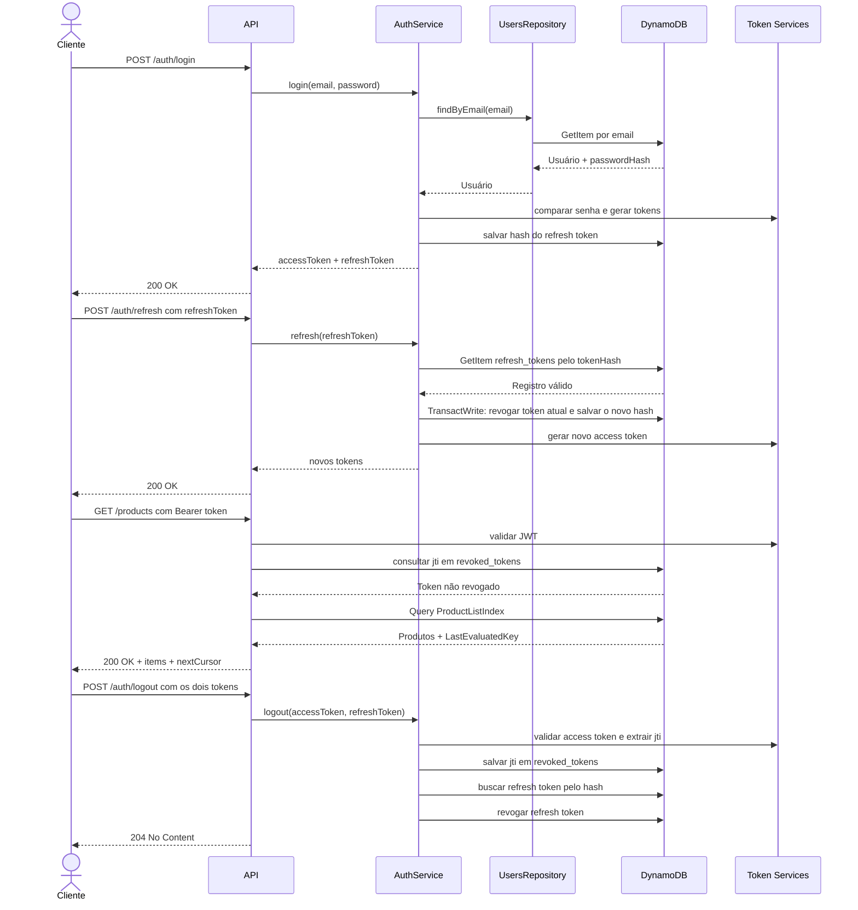

# Node Auth API

API REST em Node.js e TypeScript para cadastro e autenticação de usuários, com
sessão baseada em tokens e acesso protegido a uma lista paginada de produtos.
O projeto demonstra uma separação clara entre rotas, serviços e repositórios,
com persistência no DynamoDB.

## Destaques técnicos

- Access tokens JWT para autenticar requisições protegidas.
- Refresh tokens opacos: somente seus hashes são persistidos e cada renovação
  rotaciona o token anterior.
- Logout com revogação do access token pelo `jti` e do refresh token associado.
- DynamoDB como armazenamento de usuários, tokens revogados, refresh tokens e
  produtos.
- `GET /products` protegido e paginado por cursor opaco.
- Rate limiting por IP, em memória e por janela fixa, com `Retry-After` em
  respostas `429`. Por ser mantido no processo, esse limite vale apenas para
  uma única instância da API; um ambiente distribuído exige armazenamento
  compartilhado.
- Documentação Swagger/OpenAPI em `/docs`.
- Ambiente Docker com DynamoDB Local e testes automatizados.

## Pré-requisitos

Para executar o projeto pelo fluxo recomendado, instale:

- [Docker Engine](https://docs.docker.com/engine/install/) e o
  [Docker Compose](https://docs.docker.com/compose/install/); ou
- [Docker Desktop](https://docs.docker.com/desktop/), que já inclui o Docker
  Engine e o Docker Compose;
- [Git](https://git-scm.com/downloads), para clonar o repositório.

Node.js e npm não são necessários para executar a aplicação com Docker. Eles são
necessários apenas para desenvolvimento local, execução direta dos testes ou
execução direta do build.

## Configuração

Copie o arquivo de ambiente de exemplo:

```bash
cp .env.example .env
```

No PowerShell, use:

```powershell
Copy-Item .env.example .env
```

O arquivo `.env` não deve ser commitado. Em ambientes reais, substitua o valor
de `JWT_SECRET` por um segredo seguro.

### Limite de requisições de produtos

Somente `GET /products` possui limite de requisições: por padrão, cada IP pode
fazer 100 requisições por janela fixa de 60 segundos. As variáveis abaixo
permitem ajustar esse comportamento:

| Variável | Padrão | Descrição |
| --- | --- | --- |
| `RATE_LIMIT_MAX_REQUESTS` | `100` | Número máximo de requisições por IP na janela. |
| `RATE_LIMIT_WINDOW_SECONDS` | `60` | Duração da janela fixa, em segundos. |
| `TRUST_PROXY_HOPS` | `0` | Saltos de proxy confiáveis para determinar o IP do cliente. |

`TRUST_PROXY_HOPS=0` é o padrão seguro: headers como `X-Forwarded-For` não são
confiados. Configure um valor maior que zero somente quando a API estiver atrás
de uma quantidade conhecida de proxies controlados. Ao exceder o limite, a API
retorna `429 Too Many Requests` e o header `Retry-After` com os segundos até o
fim da janela. Esse controle é mantido em memória e, portanto, se aplica apenas
a uma única instância da API; para várias instâncias, use um armazenamento
compartilhado para o contador.

## Executando com Docker

Construa as imagens e suba os serviços:

```bash
docker compose up --build
```

O Compose inicia:

- a API Node.js na porta `3000`;
- o DynamoDB Local na porta `8000`;
- a criação das tabelas;
- sem executar o seed automaticamente.

O seed é uma operação explícita, executada separadamente:

```bash
docker compose run --rm api node dist/scripts/seed.js
```

Esse comando insere o usuário local e os produtos de exemplo. Pode ser
executado novamente em desenvolvimento; os itens usam chaves determinísticas
e serão substituídos, não duplicados.

Verifique os containers:

```bash
docker compose ps
```

Para encerrar os serviços:

```bash
docker compose down
```

Para remover também os dados persistidos do DynamoDB Local:

```bash
docker compose down -v
```

## Endpoints

| Método | Rota | Descrição | Autenticação |
| --- | --- | --- | --- |
| GET | `/health` | Verifica a saúde da API | Não |
| GET | `/docs` | Abre a documentação Swagger | Não |
| POST | `/auth/register` | Cria um usuário | Não |
| POST | `/auth/login` | Autentica um usuário | Não |
| POST | `/auth/refresh` | Renova a sessão | Não |
| POST | `/auth/logout` | Encerra a sessão | Access token |
| GET | `/products` | Lista produtos paginados | Access token |

A API estará disponível em:

```text
http://localhost:3000
```

A documentação estará disponível em:

```text
http://localhost:3000/docs
```

## Usuário local

O seed cria o usuário:

```text
E-mail: demo@example.com
Senha: Password123!
```

Essas credenciais existem apenas para facilitar o desenvolvimento local.

## Fluxo de autenticação

1. Execute o seed ou crie um usuário em `POST /auth/register`.
2. Faça login em `POST /auth/login`.
3. Use o `accessToken` no header `Authorization`.
4. Acesse `GET /products`.
5. Use `POST /auth/refresh` para rotacionar a sessão.
6. Use `POST /auth/logout` para invalidar os tokens.

## Fluxo principal



Exemplo de header protegido:

```text
Authorization: Bearer <accessToken>
```

## Desenvolvimento local com Node.js

Como alternativa ao Docker, usando Node.js 22 ou superior:

```bash
npm install
npm run db:create-tables
npm run db:seed
npm run dev
```

Para verificar o projeto:

```bash
npm test -- --runInBand
npm run test:coverage -- --runInBand
npm run build
```

### Teste manual do limite

Com a API em execução e um access token válido, envie mais requisições que o
valor de `RATE_LIMIT_MAX_REQUESTS` dentro de uma janela. A última resposta deve
ser `429` e incluir `Retry-After`:

```bash
for i in $(seq 1 101); do
  curl -i -H "Authorization: Bearer <accessToken>" http://localhost:3000/products
done
```

Em PowerShell:

```powershell
1..101 | ForEach-Object {
  Invoke-WebRequest http://localhost:3000/products -Headers @{ Authorization = "Bearer <accessToken>" }
}
```

## Documentação da estrutura

Consulte [`docs/structure.md`](docs/structure.md) para entender a organização
das pastas e a responsabilidade de cada camada.

Consulte [`docs/dependencies.md`](docs/dependencies.md) para ver as dependências
do projeto e o motivo de cada uma.

## Decisões arquiteturais

As decisões relevantes estão documentadas em [`docs/adr/README.md`](docs/adr/README.md).
